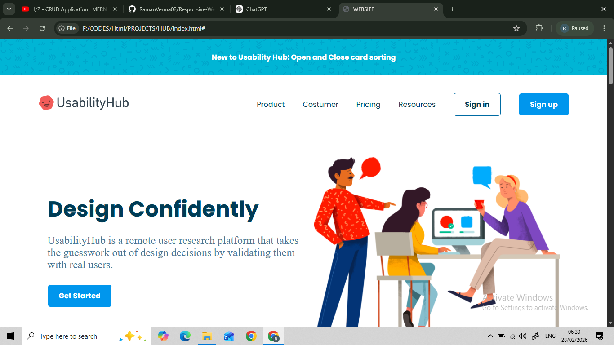
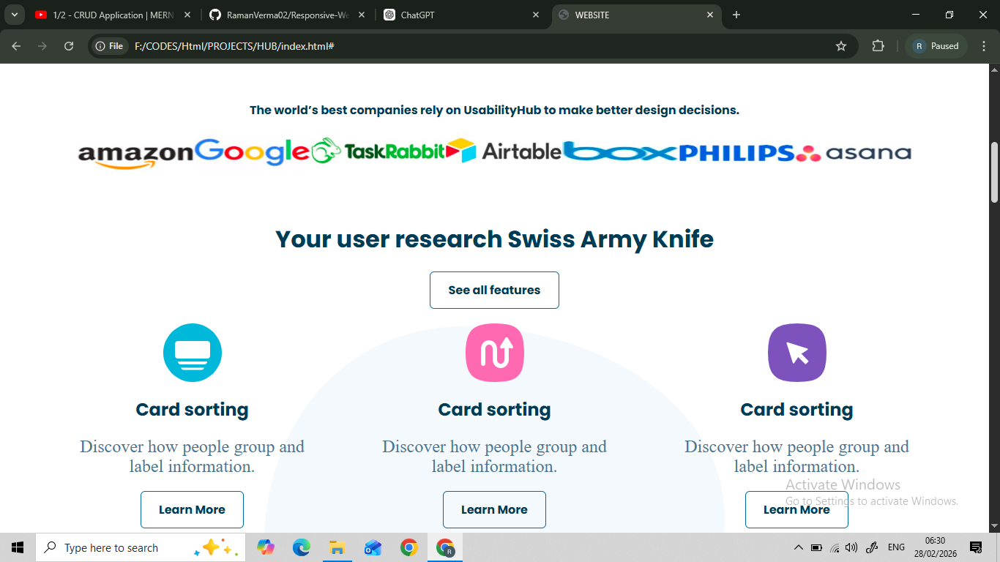
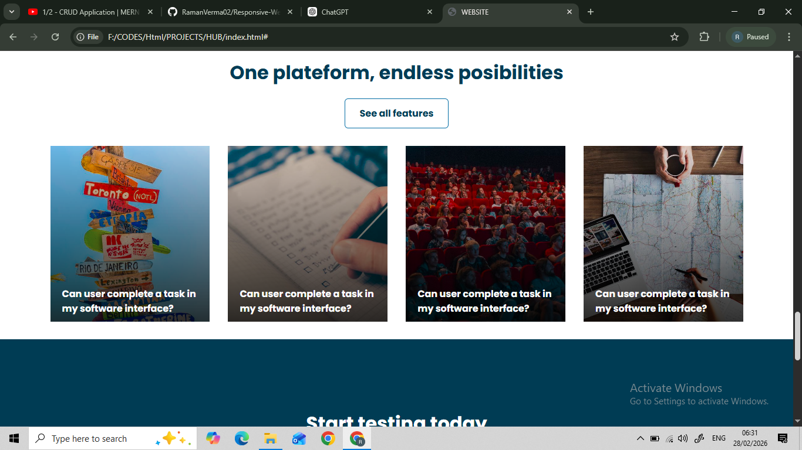
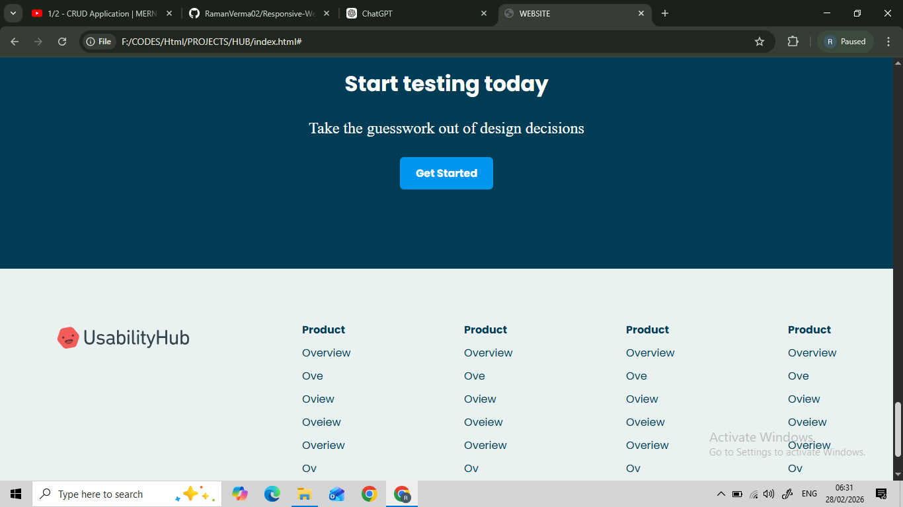

# 🌐 Responsive Website (HTML & CSS)

This repository contains a **responsive demo website** created using **pure HTML and CSS**.  
The project was built for **practice and learning purposes** to understand layout design, responsiveness, and UI structuring.

---

## ✨ Features

- Fully responsive design
- Clean and modern UI
- Structured layout sections
- Mobile-friendly design
- No frameworks used (Pure HTML & CSS)

---

## 🛠️ Tech Stack

- **HTML5**
- **CSS3**
- Flexbox
- Responsive design principles

---

## 📸 Project Screenshots

### 🏠 Home Section


---

### 🧩 Features Section



---

### 🗂️ Cards & Content Layout




---

### 📄 Footer Section


---

## ▶️ How to Run the Project

1. Clone the repository:
   ```bash
   git clone https://github.com/RamanVerma02/Responsive-Website.git
   ```
2. Open the project folder
3. Open index.html in any browser

## 🎯 Purpose of This Project

- Practice **HTML & CSS**
- Improve **responsive design skills**
- Understand real-world website layouts
- Strengthen frontend fundamentals

## 🚀 Future Improvements

- Add JavaScript for interactivity
- Improve animations
- Add more responsive breakpoints
- Optimize images and assets

## 👨‍💻 Author

**Raman Verma**  
Frontend Practice Project
